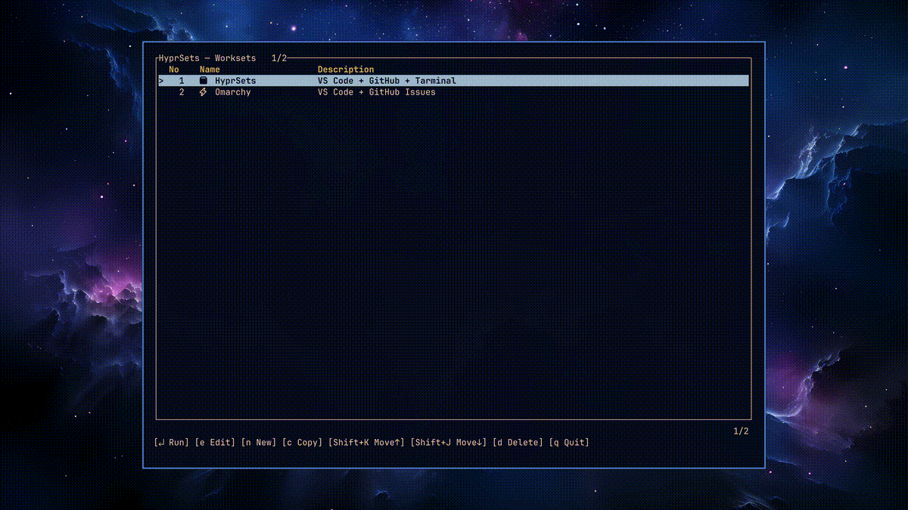

# HyprSets

HyprSets is a TUI launcher for Hyprland worksets. Define a set of commands (and an optional tiled layout) once and launch them together. The app ships with a list view to pick or create worksets, plus a layout editor that mirrors Hyprland-style splits with mouse support.

## Demo



## Features
- TUI home screen to run, duplicate, reorder, or delete worksets with mouse or keyboard.
- Layout editor that lets you split slots horizontally/vertically, tweak ratios, and edit slot commands in place.
- Launches worksets either sequentially or by walking the layout tree, waiting for windows to appear as it goes.
- Per-workset workspace targeting, including special workspaces (scratchpads), or stick to the current workspace by default.
- Prompts to close existing windows on the active workspace before launching to keep layouts clean.
- Config stored in TOML under `~/.config/hyprsets/hyprsets.toml` (created automatically with a sample).

## Requirements
- Hyprland session with `hyprctl` available on `PATH`.
- Rust toolchain with edition 2024 support (e.g. Rust 1.80+).
- `python3` only when running `scripts/package.sh`.

## Installation
From GitHub Releases (prebuilt artifacts):
- Quick install of the latest `x86_64-unknown-linux-gnu` build (alias `TARGET_ALIAS=linux-x86_64` by default; set `TARGET` or `TARGET_ALIAS` to override):
```bash
/bin/bash -c "$(curl -fsSL https://raw.githubusercontent.com/agata/hyprsets/main/scripts/install-latest.sh)"
```
Manual install: download `hyprsets-<version>-<target>.tar.gz` from the [Releases page](https://github.com/agata/hyprsets/releases), extract it, then run the bundled `install.sh`. Checksum verification is optional via the matching `.sha256` file.

From source:
```bash
git clone https://github.com/agata/hyprsets.git
cd hyprsets
cargo install --path .
# or
cargo build --release
```
The binary will live at `~/.cargo/bin/hyprsets` (with `cargo install`) or `target/release/hyprsets`.

Packaged tarball:
```bash
./scripts/package.sh            # builds, fmt + clippy by default
./scripts/package.sh --skip-checks   # skip fmt/clippy
./scripts/package.sh --target <triple>   # cross target
```
Artifacts are written under `dist/` and include a desktop entry and install script.

## Usage
Config path: `~/.config/hyprsets/hyprsets.toml` by default. Use `--config <path>` to override. First run writes a sample file if none exists.

Commands:
- `hyprsets` — open the TUI home screen.
- `hyprsets run <id>` — run a workset directly (no UI).
- `hyprsets edit <id>` — open the layout editor for a workset.
- `hyprsets version` — print the HyprSets version.
- `-v` — print verbose launch logs (hyprctl operations, waits).

Launch behavior:
- If a layout is present, HyprSets traverses it, launching each slot and applying split ratios as windows appear.
- Without a layout, commands are executed sequentially with a short delay.
- `workspace` (optional per workset) forces launch on a specific workspace name/ID or `special[:name]`; empty/missing uses the currently active workspace.
- On launch it asks whether to close existing windows on the active workspace (skipped if none are present).
- `HYPRSETS_INITIAL_SPLIT` can force the first split orientation when running layouts (`horizontal` or `vertical`; default `horizontal`).

### Autostart on Hyprland login
You can launch specific worksets automatically when Hyprland starts. Create worksets that target the workspaces you want, then call `hyprsets run <id>` from Hyprland's `exec-once` hooks.

Example worksets with explicit workspace targets:
```toml
[[workset]]
id = "ws-1"
name = "Project Atlas"
workspace = "1"
commands = [
  'kitty --title "API Logs" sh -c "cd ~/projects/atlas && tail -f logs/dev.log"',
  'brave --new-window https://status.example.com'
]

[[workset]]
id = "ws-scratch"
name = "Scratchpad Notes"
workspace = "special:scratchpad"
commands = [ 'kitty --title "Notes" nvim ~/notes/quick.md' ]
```

Then add the launch commands to your Hyprland config (`$HOME` でユーザーごとのホームを参照できます):
```
exec-once = $HOME/.local/bin/hyprsets run ws-1
exec-once = $HOME/.local/bin/hyprsets run ws-scratch
```
This will start HyprSets as part of your session startup and place each workset on its defined workspace (including special workspaces) without opening the TUI.

### TUI shortcuts
Home:
- `Enter` run, `e` edit, `n` new, `c` duplicate, `d` delete (with confirm), `Shift+J/K` reorder, `q`/`Esc` quit.
- Arrow keys or `j`/`k` to move; mouse click/scroll supported; toolbar buttons are clickable.

Editor:
- Navigation: `Tab`/`Shift+Tab` or `j`/`k`/`l` to move between slots.
- Split: `h` for horizontal, `v` or `s` for vertical; drag split bars with the mouse.
- Ratio: `+` / `-` to adjust the active split.
- Commands: `Enter` or `c` to edit the current slot command.
- Workset info: `e` or `F2` to edit name/description.
- Delete slot: `x` or `d` (confirmation shown); `w` swaps the selected slot with the next one.
- `q`/`Esc` saves and returns.

## Configuration
HyprSets writes a starter config automatically. A minimal example:
```toml
version = 1

[[workset]]
id = "sample"
name = "Sample Workset"
desc = "Code + Browser example"
workspace = ""   # optional; empty means use the active workspace

# Used when no layout is defined (optional if you rely solely on the layout tree)
commands = [
  'code -n "$HOME/ws/demo"',
  'omarchy-launch-browser --new-window "https://example.com"'
]

# Layout tree takes precedence over the sequential commands above
[workset.layout]
type = "split"
direction = "horizontal"   # or "vertical"
ratio = 1.2                # ratio between left/right (clamped for Hyprland)

[workset.layout.left]
type = "leaf"
slot_id = 1
command = 'code -n "$HOME/ws/demo"'

[workset.layout.right]
type = "leaf"
slot_id = 2
command = 'omarchy-launch-browser --new-window "https://example.com"'
```

Notes:
- `workspace` accepts a workspace name or numeric id. Use `special` or `special:<name>` to target scratchpad workspaces. Leaving it empty (or omitting it) keeps the "use current workspace" behavior.
- `cwd` and `env` can be set per workset or per slot; slot values override workset defaults.
- `ratio` is converted to Hyprland's `splitratio exact` and kept within a safe range.
- Slot `command` strings are executed via `hyprctl dispatch exec`, so shell features should be quoted accordingly.
- Each workset must have a unique `id`; `name` and `desc` are shown in the UI.

## Development
- Run `cargo fmt && cargo clippy -- -D warnings && cargo test` before pushing.
- `scripts/package.sh` performs the same checks unless `--skip-checks` is used.

## Status
The project is being prepared for public release. Feedback and issues are welcome once it is published.
